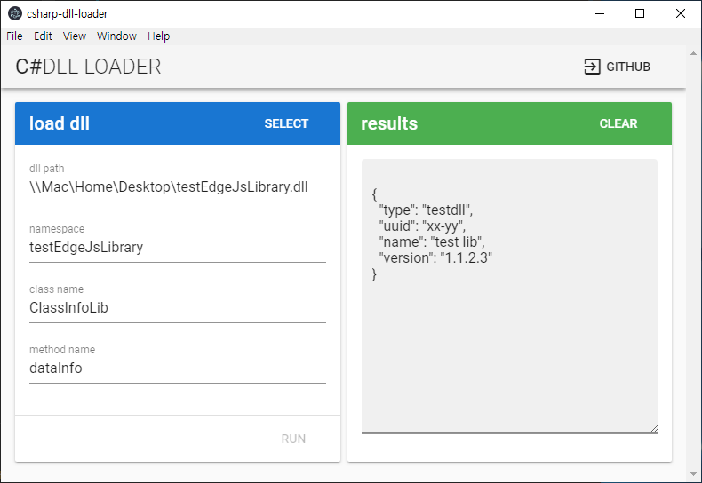

# csharp-dll-loader

c# dll load tester

## how to install

```bash
# source download
$ git clone https://github.com/loopsdteam/csharp-dll-loader.git

# go to source dir.
$ cd csharp-dll-loader

# dependancies install
$ yarn

# local test
$ yarn electron:serve

# build
$ yarn electron:build
```

## how to use

- Input fields namespace, classname, methodname 
- Select click and choose dll file
- Run click!


